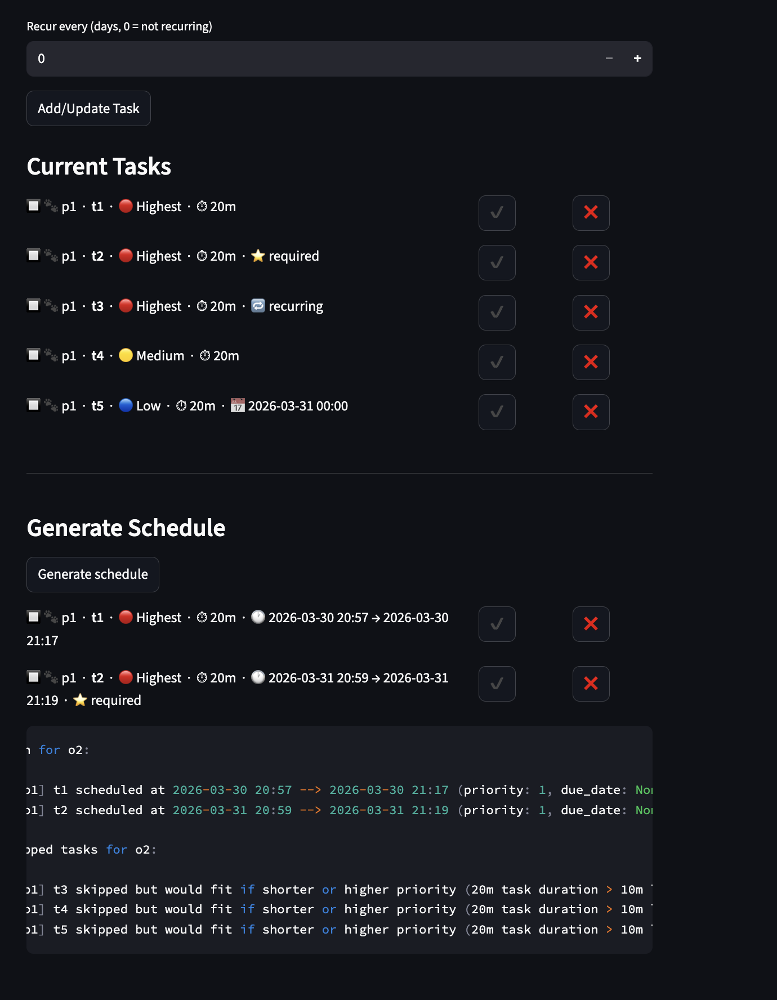
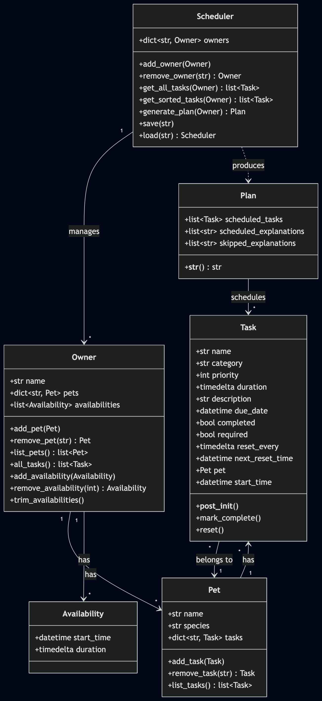
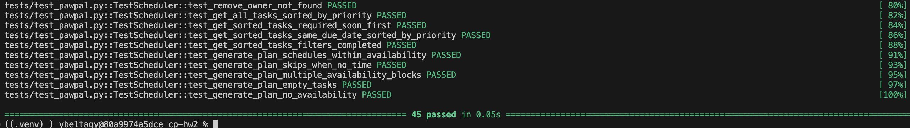

# PawPal+ (Module 2 Project)

You are building **PawPal+**, a Streamlit app that helps a pet owner plan care tasks for their pet.

## Scenario

A busy pet owner needs help staying consistent with pet care. They want an assistant that can:

- Track pet care tasks (walks, feeding, meds, enrichment, grooming, etc.)
- Consider constraints (time available, priority, owner preferences)
- Produce a daily plan and explain why it chose that plan

Your job is to design the system first (UML), then implement the logic in Python, then connect it to the Streamlit UI.

## What you will build

Your final app should:

- Let a user enter basic owner + pet info
- Let a user add/edit tasks (duration + priority at minimum)
- Generate a daily schedule/plan based on constraints and priorities
- Display the plan clearly (and ideally explain the reasoning)
- Include tests for the most important scheduling behaviors

## Getting started



### Setup

```bash
python -m venv .venv
source .venv/bin/activate  # Windows: .venv\Scripts\activate
pip install -r requirements.txt
```

## UML Diagram



## Smarter Scheduling

Beyond the basic requirements, PawPal+ includes several features that make scheduling more realistic:

- **Multiple availability blocks** — Owners define specific time windows (e.g., 8:00–9:00 and 17:00–18:00) instead of a single "available minutes" number. Overlapping blocks are automatically merged.
- **Due date urgency** — Required tasks due today or tomorrow are scheduled before everything else, sorted by due date then priority. This prevents urgent tasks from being crowded out.
- **Recurring tasks** — Non-required tasks can have a `reset_every` interval. After completion, they auto-reset once the interval passes, reappearing in future plans.
- **Task validation** — `required` and `reset_every` are enforced as mutually exclusive at creation time. Due dates must be at day granularity.
- **Availability trimming** — Past availability blocks are automatically removed or shortened before each plan generation, so the schedule always reflects current reality.
- **Persistence** — Scheduler state (owners, pets, tasks, availabilities) is saved to disk via pickle and restored on app restart.
- **48 unit tests** — Full coverage of all classes and methods, including edge cases like overlapping availability merges, completed task filtering, multi-block scheduling, and next-slot lookups.

## Agent Mode Usage for Advanced Scheduling

I Implemented the due-date, priority, and multi-availability scheduling using kiro.

1. I built it in steps. First, I had the singe availability scheduling that only used the priority.
2. Then I added the logic to prioritize tasks that are due today or tomorrow.
3. Then I added the multi-availability logic.
4. Then I added the logic to squash overlapping availabilities.

Throughout this process, I used kiro-cli to write the boilerplate code. But I had to implement some the algorithms and logic myself because the AI output didn't make sense. Even then, I asked Kiro to review my code and it helped me find some bugs. It also made decent fixes for them.

I then had Kiro write the unit tests and update the streamlit app mostly independently.

## Testing PawPal+

Run the full test suite:

```bash
source .venv/bin/activate
python -m pytest tests/ -v
```

The 48 tests cover:

- **Task** — completion, recurring reset logic, validation (mutually exclusive fields, due date granularity)
- **Pet** — add/remove/list tasks, overwrite behavior, pet back-references
- **Owner** — add/remove pets, availability management (insert, merge overlapping, reject past), task aggregation
- **Plan** — formatted output with and without skipped tasks
- **Formatters** — `fmt_dt` and `fmt_td` for datetime/timedelta display
- **Scheduler** — owner management, task sorting (urgency, priority, completed filtering), plan generation (single/multi-block, skipping, empty cases), next-slot lookups



## Extra Credit

I did challenges 1-4. 