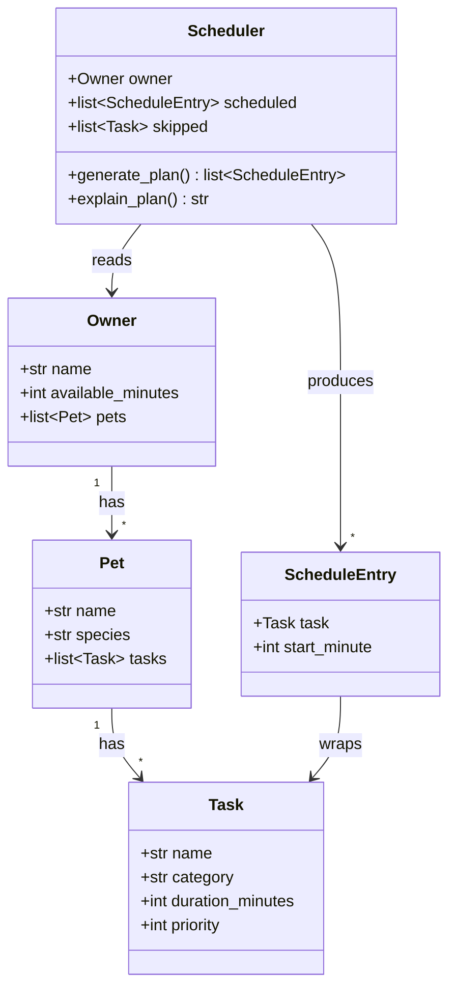

# PawPal+ Class Diagram

```mermaid
classDiagram
    class Owner {
        +str name
        +int available_minutes
        +list~Pet~ pets
    }

    class Pet {
        +str name
        +str species
        +list~Task~ tasks
    }

    class Task {
        +str name
        +str category
        +int duration_minutes
        +int priority
    }

    class ScheduleEntry {
        +Task task
        +int start_minute
    }

    class Scheduler {
        +Owner owner
        +list~ScheduleEntry~ scheduled
        +list~Task~ skipped
        +generate_plan() list~ScheduleEntry~
        +explain_plan() str
    }

    Owner "1" --> "*" Pet : has
    Pet "1" --> "*" Task : has
    Scheduler --> Owner : reads
    Scheduler --> "*" ScheduleEntry : produces
    ScheduleEntry --> Task : wraps
```
