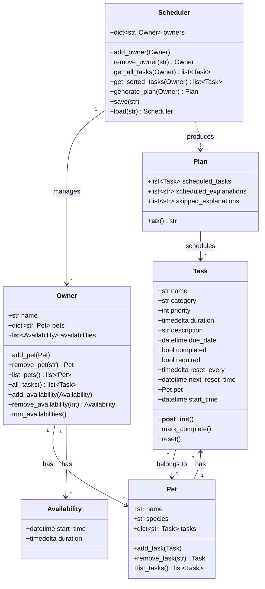

# PawPal+ Class Diagram

```mermaid
classDiagram
    class Task {
        +str name
        +str category
        +int priority
        +timedelta duration
        +str description
        +datetime due_date
        +bool completed
        +bool required
        +timedelta reset_every
        +datetime next_reset_time
        +Pet pet
        +datetime start_time
        +__post_init__()
        +mark_complete()
        +reset()
    }

    class Pet {
        +str name
        +str species
        +dict~str, Task~ tasks
        +add_task(Task)
        +remove_task(str) Task
        +list_tasks() list~Task~
    }

    class Availability {
        +datetime start_time
        +timedelta duration
    }

    class Owner {
        +str name
        +dict~str, Pet~ pets
        +list~Availability~ availabilities
        +add_pet(Pet)
        +remove_pet(str) Pet
        +list_pets() list~Pet~
        +all_tasks() list~Task~
        +add_availability(Availability)
        +remove_availability(int) Availability
        +trim_availabilities()
    }

    class Plan {
        +list~Task~ scheduled_tasks
        +list~str~ scheduled_explanations
        +list~str~ skipped_explanations
        +__str__() str
    }

    class Scheduler {
        +dict~str, Owner~ owners
        +add_owner(Owner)
        +remove_owner(str) Owner
        +get_all_tasks(Owner) list~Task~
        +get_sorted_tasks(Owner) list~Task~
        +generate_plan(Owner) Plan
        +save(str)
        +load(str) Scheduler
    }

    Owner "1" --> "*" Pet : has
    Owner "1" --> "*" Availability : has
    Pet "1" --> "*" Task : has
    Task "*" --> "1" Pet : belongs to
    Scheduler "1" --> "*" Owner : manages
    Scheduler ..> Plan : produces
    Plan --> "*" Task : schedules
```

